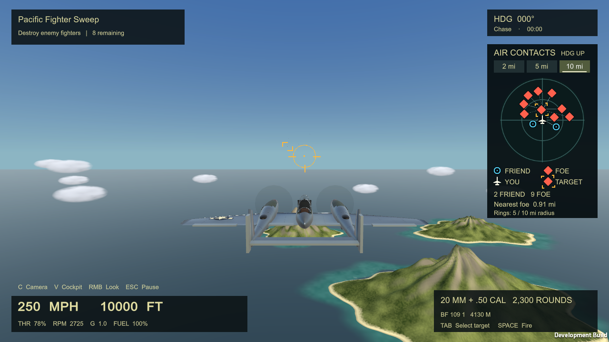
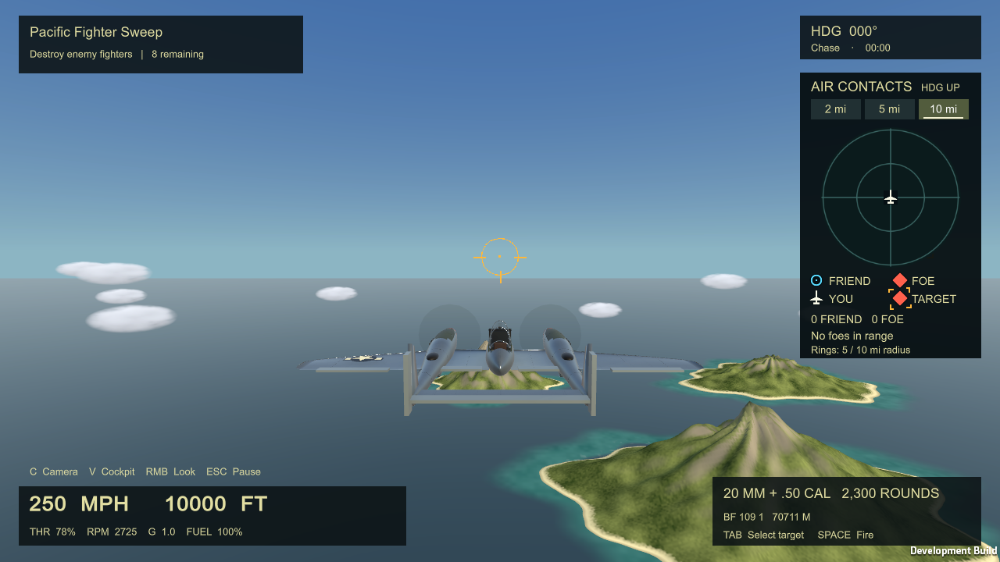

# Radar friend/foe display

- Cyan circle: friendly aircraft.
- Solid red diamond: hostile aircraft.
- White aircraft silhouette: your aircraft.
- Amber corner brackets: selected hostile, retaining its red diamond.

This screenshot is from the opt-in radar smoke fixture: two friendly contacts
and one additional hostile are temporarily added to the eight-enemy mission.
Those three test contacts are absent in normal play. Thin leader lines connect
separated symbols to their actual plot positions when contacts overlap.

The final Windows build passes radar acceptance plus mixed-team, range and
empty-state runtime checks. Visual inspection covered 1600 x 900 / DX12 and
1280 x 720 / DX11; the latter was repeated after the header spacing adjustment.
