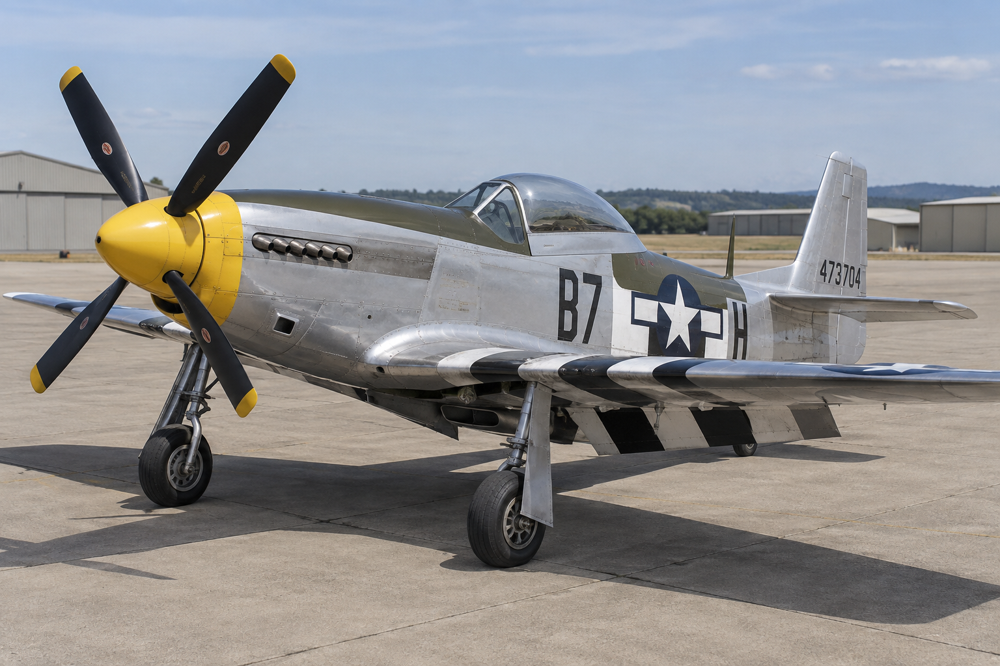
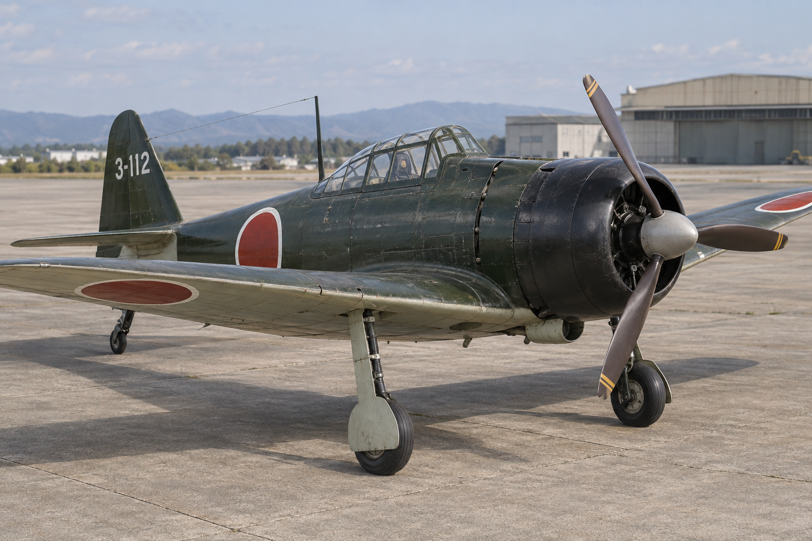
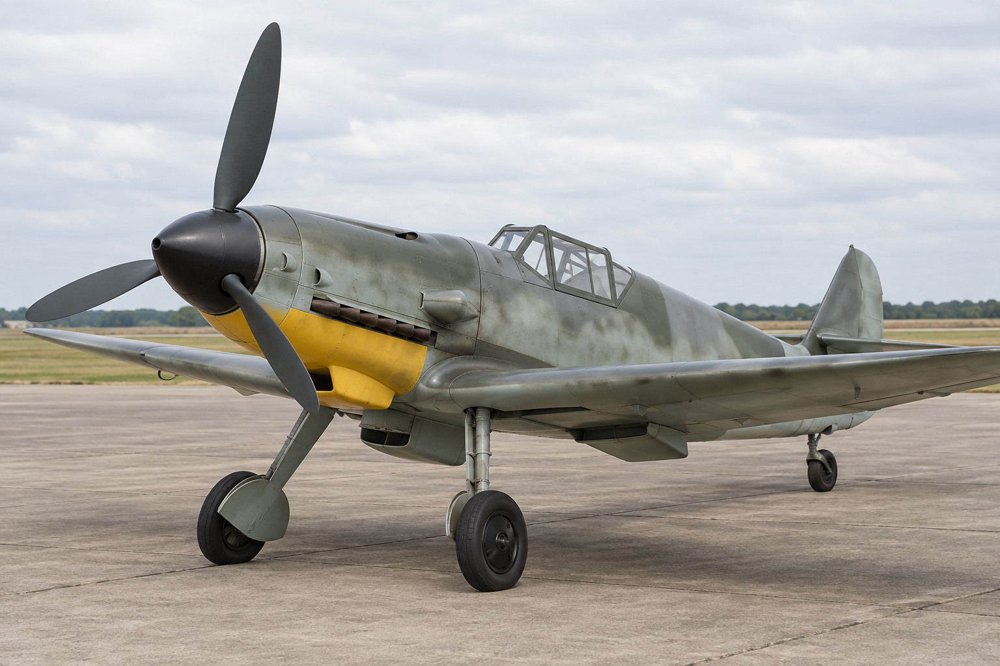
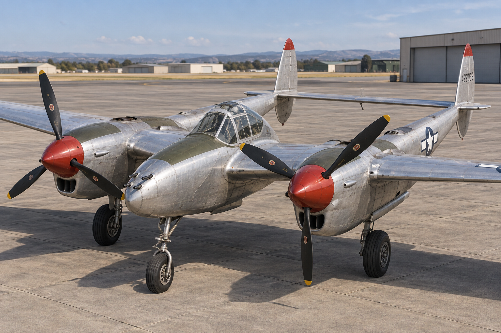

# Aircraft image set

Created with the built-in image_gen tool. These are AI-generated visual targets,
not photographs, technical drawings, or screenshots of the game.

## P-51D Mustang

## A6M Zero

## Bf 109 G-6

## P-38J Lightning

The exact final prompts are in [prompts.json](prompts.json). The Bf 109 reference
uses an unmarked restoration scheme. Generated paint codes and small details may
differ from the simulator; the existing game liveries remain the authority.

The corresponding authored airframes and close views of their revised noses are
rendered separately into [../../Previews](../../Previews).

Geometry checks used the existing Mustang manual plus these museum references:

- [National Naval Aviation Museum: A6M2 Zero](https://www.history.navy.mil/content/history/museums/nnam/explore/collections/aircraft/a/a6m2-zero0.html)
- [Australian War Memorial: Bf 109G-6](https://www.awm.gov.au/collection/REL%3A16285)
- [Smithsonian: P-38J-10-LO](https://airandspace.si.edu/collection-objects/lockheed-p-38j-10-lo-lightning/nasm_A19600295000)

These support recognition and proportions; the meshes remain historically
inspired game assets, rather than blueprint-certified reproductions.
